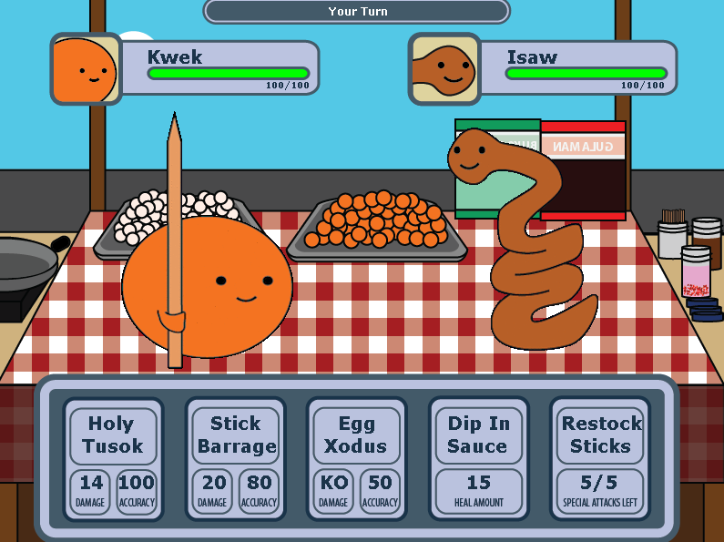

# Street Food Wars

A turn-based, role-playing game developed in Java to learn programming fundamentals

You are Kwek, a kwek-kwek ball tasked to defeat Isaw. 
Choose from your set of moves in order to bring down Isaw.
Be careful! Isaw has the ability to multiply! Defeat the enemy quickly!

## About
This is the Machine Problem for my college course CS 12: Computer Programming II
We used MarioWindow, a simple game engine built in Java by my Professor and his past students

In this course, we learned about:
- Recursion
- Abstract data types: stacks, queues, linked structures
- Programming Interfaces
- Object-Oriented Programming
 - Classes
 - Inheritance
 - Polymorphism
- Event handling
- Exception handling

We were tasked to implement the lessons in our video game. 
All the assets were made by me using Adobe Illustrator.

## Usage
- Clone this repo to your local machine using `https://github.com/rdp-jr/street-food-wars.git`
- Open your console in the directory and type `java CS12MP3PrincipioRobertoJr`

